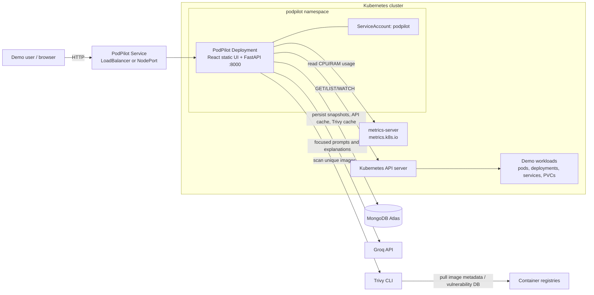

# PodPilot test plan and demo architecture

This plan is deliberately broad. Treat **P0** tests as required before a
demo, **P1** as required before delivery, and **P2** as quality hardening.

## 1. System under test

PodPilot is a read-only Kubernetes observability application. It collects a
cluster snapshot, calculates estimated resource cost, stores named snapshots,
analyses focused slices with Groq, scans unique container images with Trivy,
and presents the result in a React dashboard.

### Components and ownership

| Component | Location | Responsibility |
| --- | --- | --- |
| React UI | `frontend/src` | Dashboard, snapshot selection, chat, reports |
| FastAPI API | `backend/main.py` | HTTP API, cache coordination, orchestration |
| Snapshot collector | `backend/snapshot.py` | Reads Kubernetes resources and metrics |
| Cost engine | `backend/cost.py` | Calculates estimated requested/actual/wasted cost |
| Snapshot sanitizer | `backend/sanitize.py` | Removes unneeded fields before persistence/AI |
| AI analysis | `backend/health.py`, `backend/analyzer.py` | Chat and category analysis via Groq |
| Vulnerability scanning | `backend/trivy.py` | Scans unique images and caches results |
| Drift | `backend/drift_detection.py` | Compares saved snapshots and explains changes |
| Reports | `backend/report.py` | Builds impact report and optional PDF |
| Persistence | `backend/db.py` | MongoDB cache, snapshots, image scan cache |
| Deployment | `Dockerfile`, `k8s/podpilot.yaml` | Builds and deploys one PodPilot container |

## 2. Kubernetes architecture for the demo



### Demo narration for this diagram

"The browser talks to one PodPilot service. Inside the PodPilot pod, FastAPI
serves the API and, in Docker mode, the compiled React UI. PodPilot uses a
read-only service account to ask the Kubernetes API for cluster objects and
metrics-server for live CPU and memory usage. It stores named historical
snapshots and scan results in MongoDB. Groq explains already-collected data;
it does not control the cluster. Trivy scans unique container images."

### Kubernetes objects required

| Object | Why it is needed | Verification |
| --- | --- | --- |
| Namespace `podpilot` | Isolation for the application | `kubectl get ns podpilot` |
| Secret `podpilot-secrets` | Groq/Mongo/model/cluster configuration | `kubectl get secret -n podpilot podpilot-secrets` |
| ServiceAccount `podpilot` | Pod identity | `kubectl get sa -n podpilot podpilot` |
| ClusterRole + binding | Read-only, cluster-wide visibility | `kubectl auth can-i --as=system:serviceaccount:podpilot:podpilot list pods --all-namespaces` |
| Deployment `podpilot` | Runs the container | `kubectl rollout status deploy/podpilot -n podpilot` |
| Service `podpilot` | Makes the dashboard reachable | `kubectl get svc -n podpilot podpilot` |
| metrics-server | Supplies actual CPU/RAM consumption | `kubectl top pods -A` |

## 3. Test environments and test data

### Environments

| Environment | Purpose | External services |
| --- | --- | --- |
| Local unit | Fast, deterministic code tests | mocked Kubernetes, Groq, Mongo, Trivy |
| Local integration | Run FastAPI and React together | local Minikube preferred |
| Kubernetes demo | Full realistic flow | cluster, metrics-server, MongoDB, Groq, Trivy |
| Failure mode | Validate graceful errors | intentionally disable one dependency at a time |

### Seed a predictable demo cluster

Create or retain resources that cover each finding class:

| Scenario | Expected PodPilot signal |
| --- | --- |
| Over-requested CPU/memory workload | Monthly cost waste |
| Pending pod / bad image | Reliability and performance finding |
| Deployment with desired > ready replicas | Reliability finding |
| Pod with restarts | Reliability finding and snapshot drift |
| No CPU or memory limit | Security warning |
| Image tagged `latest` or no tag | Security report finding |
| NodePort service | Critical security finding |
| LoadBalancer service | Exposure finding |
| Unattached PVC | Storage / report finding |
| Version 1 then version 2 of a workload | Drift and impact report |

Keep system namespaces hidden in the UI during the main demo. Otherwise
control-plane pods generate distracting root/limit findings.

## 4. P0 smoke test: run before every demo

Run these after the app starts, in this order.

```bash
curl -f http://localhost:8000/api/status
curl -f http://localhost:8000/snapshot
curl -f http://localhost:8000/history
curl -f http://localhost:8000/cost
curl -f http://localhost:8000/reliability
curl -f http://localhost:8000/performance
curl -f http://localhost:8000/storage
curl -f http://localhost:8000/security
```

Then manually confirm:

- Browser opens at `http://localhost:5173` for dev mode, or the Service URL in Kubernetes mode.
- A saved snapshot appears in the selector.
- Cost Breakdown renders at least one pod row.
- Security renders findings or the legitimate empty state.
- Chat returns an answer to a starter question.
- Drift renders either a comparison or the legitimate first-snapshot state.
- Impact Report can compare two different snapshots.
- Browser DevTools has no red network errors.

Do not press PDF export until it has been checked separately: it requires
WeasyPrint in the deployed Python environment.

## 5. Automated test strategy

### Test layers

| Layer | Scope | Dependencies mocked? | Gate |
| --- | --- | --- | --- |
| Unit | Parsers, calculations, diffs, transformations | Yes | P0/P1 |
| API contract | FastAPI requests/responses/status codes | Kubernetes/Groq/Trivy/Mongo mocked | P0/P1 |
| Integration | Full backend with controlled local services | Minimal mocking | P1 |
| UI component | React loading/error/data states | API mocked | P1 |
| E2E | Browser through real dashboard | No, demo cluster | P0/P1 |
| Deployment | Docker/Kubernetes manifest and RBAC | Real cluster | P0 |
| Non-functional | latency, resilience, security, accessibility | Varies | P1/P2 |

### Suggested commands

The repository contains ad-hoc test scripts but not yet a unified test runner.
Before delivery, standardize on `pytest` for the backend and a browser runner
such as Playwright for the frontend.

```bash
# Existing frontend build gate
cd frontend && npm run build

# Useful existing backend scripts once the backend is running
cd backend && python3 test_api.py
cd backend && python3 test_podpilot.py
```

The current `test_drift.py` is stale because snapshot helpers are now async;
replace it with async pytest tests rather than treating its output as a gate.

## 6. Backend unit test matrix

### A. Kubernetes quantity parsing: `snapshot.py`

| ID | Priority | Input | Expected result |
| --- | --- | --- | --- |
| SNAP-01 | P0 | CPU `125m` | `0.125` cores |
| SNAP-02 | P0 | CPU `1`, `1000000u`, `1000000000n` | `1.0` core each |
| SNAP-03 | P1 | Invalid/empty CPU value | `0.0`, no exception |
| SNAP-04 | P0 | Memory `256Mi`, `1Gi`, `1Ti` | Correct GB conversion |
| SNAP-05 | P1 | Decimal units `K/M/G/T` | Correct GB conversion |
| SNAP-06 | P1 | Invalid/empty memory value | `0.0`, no exception |
| SNAP-07 | P0 | In-cluster config succeeds | Uses ServiceAccount and `CLUSTER_NAME` |
| SNAP-08 | P0 | In-cluster config fails, kubeconfig succeeds | Uses local cluster context |
| SNAP-09 | P0 | Both config mechanisms fail | Returns `{}` without process crash |
| SNAP-10 | P1 | Metrics API unavailable | Snapshot still contains objects; usage is zero |
| SNAP-11 | P1 | Pod has multiple containers | Requests, usage, restarts and images are aggregated |
| SNAP-12 | P1 | PVC mounted by a pod | `is_attached=True` |
| SNAP-13 | P1 | Service has no port | Port defaults safely |

### B. Cost calculations: `cost.py`

| ID | Priority | Scenario | Expected result |
| --- | --- | --- | --- |
| COST-01 | P0 | Request equals actual usage | Zero waste |
| COST-02 | P0 | Request exceeds actual usage | Positive waste |
| COST-03 | P0 | Actual usage exceeds request | Waste remains zero, never negative |
| COST-04 | P0 | Missing requests/metrics | Uses zero safely |
| COST-05 | P0 | Two pods | Summary equals sum of per-pod values |
| COST-06 | P1 | Input snapshot reused after enrichment | Original object is unchanged (deep copy) |
| COST-07 | P1 | Exact rounding | Cost fields are rounded to six decimal places |
| COST-08 | P1 | Monthly conversion | Hourly waste × 730 |

### C. Sanitization: `sanitize.py`

| ID | Priority | Scenario | Expected result |
| --- | --- | --- | --- |
| SAN-01 | P0 | Valid enriched snapshot | Output has exactly the supported top-level sections |
| SAN-02 | P0 | Extra/raw Kubernetes fields | They are absent from sanitized output |
| SAN-03 | P0 | Missing optional values | Type-safe defaults are emitted |
| SAN-04 | P1 | Costs and security fields | Needed fields are preserved |
| SAN-05 | P1 | Very large snapshot | Token warning is emitted, process does not fail |
| SAN-06 | P1 | Input mutation check | Sanitization does not mutate input |

### D. Drift: `drift_detection.py`

| ID | Priority | Scenario | Expected result |
| --- | --- | --- | --- |
| DRIFT-01 | P0 | Identical snapshots | Empty list and empty summary |
| DRIFT-02 | P0 | Deployment replicas change | Correct replica change message |
| DRIFT-03 | P0 | New and removed pod | Correct messages with namespace |
| DRIFT-04 | P0 | Restart count changes | Correct before/after message |
| DRIFT-05 | P0 | Pod status changes | Correct status message |
| DRIFT-06 | P0 | Service type changes | Correct type message |
| DRIFT-07 | P0 | PVC status changes | Correct status message |
| DRIFT-08 | P0 | Empty diff passed to AI explainer | Returns “No drift detected.” and makes no Groq call |
| DRIFT-09 | P1 | Groq rate limit | Retries then returns a useful degraded response |
| DRIFT-10 | P1 | No database | Load helpers return safe empty result |

### E. AI slicing and response parsing: `health.py`

| ID | Priority | Scenario | Expected result |
| --- | --- | --- | --- |
| AI-01 | P0 | Cost question | Prompt contains cost summary and relevant pods |
| AI-02 | P0 | Security question | Prompt contains pods and exposed services |
| AI-03 | P0 | Storage question | Prompt contains PVCs |
| AI-04 | P0 | General question | Includes at least pod metadata |
| AI-05 | P0 | Valid JSON response | Parsed `issues` and `summary` returned |
| AI-06 | P0 | JSON in markdown fence | Parsed correctly |
| AI-07 | P0 | Invalid model output | Safe empty issues response; no 500 |
| AI-08 | P1 | Missing resource fields | Slices are still JSON serializable |
| AI-09 | P1 | Security solution request | Prompt includes title, remediation, and all resources |
| AI-10 | P1 | Full proactive analysis | Categories are combined, deduplicated and severity-ranked |

### F. Security policy checks: `security.py`

| ID | Priority | Scenario | Expected result |
| --- | --- | --- | --- |
| SEC-01 | P0 | `runs_as_root=True` | Root-containers check fails with namespace/name |
| SEC-02 | P0 | CPU limit missing | CPU-limits check fails |
| SEC-03 | P0 | Memory limit missing | Memory-limits check fails |
| SEC-04 | P0 | `:latest` or no image tag | Unpinned-images check fails |
| SEC-05 | P0 | NodePort service | Open-NodePorts check fails |
| SEC-06 | P1 | Fully compliant snapshot | Every check passes |

Note: the Security dashboard endpoint currently uses AI findings plus Trivy.
The deterministic checks in `security.py` are directly used by the Impact
Report. Test both paths; do not assume their finding counts match exactly.

### G. Trivy: `trivy.py`

| ID | Priority | Scenario | Expected result |
| --- | --- | --- | --- |
| TRIVY-01 | P0 | Repeated image across pods | One unique image scan |
| TRIVY-02 | P0 | Valid scan JSON with CRITICAL/HIGH CVEs | Correct counts and CVE list |
| TRIVY-03 | P0 | Trivy exits non-zero/no JSON | Structured error, no crash |
| TRIVY-04 | P0 | Trivy timeout | `timeout` result after 120 seconds |
| TRIVY-05 | P1 | Cached image in memory | No subprocess call |
| TRIVY-06 | P1 | Cached image in Mongo | No subprocess call; cache becomes in-memory |
| TRIVY-07 | P1 | Two requests scan same image | One scan; both callers receive result |
| TRIVY-08 | P1 | Four images | Concurrent scanning is capped at three |
| TRIVY-09 | P1 | CVEs present | Issue severity is critical if any critical CVE exists |
| TRIVY-10 | P2 | Vulnerability DB/registry unavailable | Useful per-image error displayed |

### H. Reports: `report.py`

| ID | Priority | Scenario | Expected result |
| --- | --- | --- | --- |
| RPT-01 | P0 | Same `from_id` and `to_id` | HTTP 422 |
| RPT-02 | P0 | Invalid object IDs | HTTP 422 |
| RPT-03 | P0 | Missing snapshot ID | HTTP 404 |
| RPT-04 | P0 | Mongo unavailable | HTTP 503 |
| RPT-05 | P0 | Two known snapshots | Correct before/after totals and drift list |
| RPT-06 | P0 | New security issue | Listed as new issue, score decreases |
| RPT-07 | P0 | Fixed/removed wasteful pod | Listed as savings |
| RPT-08 | P1 | No Groq key or Groq failure | Deterministic fallback executive summary |
| RPT-09 | P1 | Report HTML | Escapes resource names to prevent HTML injection |
| RPT-10 | P1 | Complete report + WeasyPrint | Valid non-empty PDF response |
| RPT-11 | P1 | WeasyPrint absent | HTTP 503 with actionable message |

## 7. FastAPI contract test matrix

Use FastAPI `TestClient`/`httpx.AsyncClient`; mock every external connector.
For every successful JSON endpoint assert content type, schema, no secret
values, and no unexpected stack trace.

| ID | Method/path | Happy-path assertions | Negative-path assertions |
| --- | --- | --- | --- |
| API-01 | `GET /api/status` | 200; status/service/version | N/A |
| API-02 | `GET /snapshot` | 200; `data`, `cached_at`, pod/node counts | Snapshot collection failure becomes documented 500 |
| API-03 | `GET /snapshot?snapshot_id=` | Returns exact historical snapshot | Invalid/missing ID is 404/controlled error |
| API-04 | `GET /history` | Newest-first metadata; string IDs; cached analyses | Mongo unavailable returns controlled failure |
| API-05 | `POST /chat` | Question, answer, age, snapshot ID | Empty/malformed body returns 422; bad snapshot rejected |
| API-06 | `POST /chat` with `hide_system=true` | System namespaces omitted from AI input | Does not modify stored snapshot |
| API-07 | `POST /solution` | Returns AI text only | Missing title/description/remediation/resources returns 422 |
| API-08 | `GET /cost` | Issues/summary response; cache populated | AI error handled without unhandled exception |
| API-09 | `GET /reliability` | Same contract | Same failure behavior |
| API-10 | `GET /performance` | Same contract | Same failure behavior |
| API-11 | `GET /storage` | Same contract | Same failure behavior |
| API-12 | `GET /security` | AI issues merged with Trivy issues | Trivy error does not take down endpoint |
| API-13 | `GET /trivy` | Scan results, summary, issues | Missing Trivy returns structured scan errors |
| API-14 | `GET /drift` | Compares current vs previous | First snapshot produces first-snapshot response |
| API-15 | `GET /compare` | Selected pair and AI explanation | Bad IDs/missing record controlled |
| API-16 | `POST /refresh` | Captures, persists, returns pod count/time | Kubernetes/Mongo failure controlled |
| API-17 | `POST /refresh` with name/comments | Values appear in `/history` | Invalid types return 422 |
| API-18 | `GET /report/snapshots` | Saved snapshot metadata | Mongo unavailable = 503 |
| API-19 | `GET /report/impact` | Full report schema | Same ID/bad IDs/missing IDs covered |
| API-20 | `POST /report/pdf` | PDF content type + attachment header | Incomplete payload = 422; missing renderer = 503 |
| API-21 | CORS preflight | Expected origin/method/header behavior | Ensure production policy is intentional |

### Cache-specific API tests

| ID | Priority | Scenario | Expected result |
| --- | --- | --- | --- |
| CACHE-01 | P0 | First current snapshot request | Calls snapshot, cost, sanitize; saves cache |
| CACHE-02 | P0 | Request inside 300-second window | Reuses current snapshot |
| CACHE-03 | P0 | Structural fingerprint unchanged | Keeps category analyses |
| CACHE-04 | P0 | Pod/deployment/service/PVC/restart structural change | Invalidates category analyses |
| CACHE-05 | P1 | Metrics-only change | Does not invalidate analyses |
| CACHE-06 | P1 | Historical category analysis exists | Uses snapshot's cached result |
| CACHE-07 | P1 | Historical category analysis missing | Computes then persists result |
| CACHE-08 | P1 | Mongo write fails | In-memory result remains usable |

## 8. Frontend component and browser tests

### Component tests

| ID | Priority | Screen | Cases |
| --- | --- | --- | --- |
| UI-01 | P0 | App | History loads; latest snapshot selected |
| UI-02 | P0 | Header | Snapshot selector, hide-system toggle, tab navigation |
| UI-03 | P0 | Header refresh modal | Name/comments submitted; loading state visible |
| UI-04 | P0 | Chat | Starter prompts, send button, Enter sends, Shift+Enter adds line |
| UI-05 | P0 | Chat | API success, API error, historical snapshot request, hide-system payload |
| UI-06 | P0 | Cost Breakdown | Loading, API error, namespace groups, system filtering, zero-cost state |
| UI-07 | P0 | Security | Loading, error, severity filter, resource view, solution response |
| UI-08 | P0 | Drift | Loading, first snapshot, no changes, changes, compare modal, error |
| UI-09 | P0 | Sidebar | Stats, issue count, category selection, load-more, collapsed state |
| UI-10 | P0 | Impact Report | Snapshot list, invalid same pair, generate, AI-summary fallback display |
| UI-11 | P1 | PDF export | Download blob, disabled/busy/error state |
| UI-12 | P1 | `cachedFetch` | Only caches immutable snapshot-ID GETs; response body can be consumed twice |

### End-to-end user journeys

| ID | Priority | Journey | Expected outcome |
| --- | --- | --- | --- |
| E2E-01 | P0 | Open dashboard | No blank screen; selected snapshot shown |
| E2E-02 | P0 | Cost journey | User sees cost and largest waste by namespace |
| E2E-03 | P0 | Security journey | User filters critical issues and opens an AI remediation |
| E2E-04 | P0 | Chat journey | User asks cost/security question and receives snapshot-grounded answer |
| E2E-05 | P0 | Snapshot journey | User creates named snapshot and it appears after refresh |
| E2E-06 | P0 | Drift journey | User compares two snapshots and sees changed resources |
| E2E-07 | P0 | Report journey | User compares two different snapshots and reads cost/security/drift results |
| E2E-08 | P1 | Browser refresh/deep link | App reloads without losing selected-server availability |
| E2E-09 | P1 | Slow AI/Trivy call | Loading state stays visible and UI remains responsive |
| E2E-10 | P1 | External dependency failure | Clear error state, no uncaught UI exception |

## 9. Kubernetes deployment tests

| ID | Priority | Test | Expected result |
| --- | --- | --- | --- |
| K8S-01 | P0 | `kubectl apply -f k8s/podpilot.yaml` | All resources create/update cleanly |
| K8S-02 | P0 | Deployment rollout | Ready replica becomes available |
| K8S-03 | P0 | `/api/status` readiness and liveness probes | Both become healthy |
| K8S-04 | P0 | Service reachability | Browser/API reachable through Service |
| K8S-05 | P0 | In-cluster snapshot | Snapshot contains real cluster resources |
| K8S-06 | P0 | RBAC allowed operations | Can list pods/nodes/services/PVCs/deployments/metrics |
| K8S-07 | P0 | RBAC denied operations | Cannot create, patch, delete, exec, or scale workloads |
| K8S-08 | P1 | Pod restart | Mongo-backed snapshots and Trivy cache remain available |
| K8S-09 | P1 | Bad/missing secret value | Pod errors clearly; no secret appears in logs/UI |
| K8S-10 | P1 | `metrics-server` unavailable | App remains available with zero/missing live usage |
| K8S-11 | P1 | Cluster has many images | Trivy concurrency cap prevents resource exhaustion |
| K8S-12 | P2 | Resource limits | App operates within requested CPU/memory limits |

### RBAC proof commands

```bash
kubectl auth can-i --as=system:serviceaccount:podpilot:podpilot list pods --all-namespaces
kubectl auth can-i --as=system:serviceaccount:podpilot:podpilot list nodes
kubectl auth can-i --as=system:serviceaccount:podpilot:podpilot get pods.metrics.k8s.io -A
kubectl auth can-i --as=system:serviceaccount:podpilot:podpilot delete pods -A
kubectl auth can-i --as=system:serviceaccount:podpilot:podpilot patch deployments -A
```

Expected: the first three are `yes`; delete and patch are `no`.

## 10. Resilience, security, and quality tests

### Failure injection table

| Dependency removed or degraded | Expected user-visible behavior |
| --- | --- |
| Kubernetes API unavailable | Current-snapshot refresh reports controlled error; server stays alive |
| metrics-server unavailable | Inventory works; usage/cost-waste precision is reduced |
| MongoDB unavailable | Current snapshot may work in memory; history/reports are unavailable with clear error |
| Groq timeout/rate limit | Cached results still work; new AI work returns useful degraded state |
| Trivy missing/timeout | Security page still shows non-Trivy analysis; scan result explains failure |
| Image registry unavailable | Per-image Trivy error, no whole-request crash |
| Browser loses backend connection | Screen shows error, retry via refresh/page reload works |

### Security checks

- Verify no secret value is committed, rendered in UI, returned by endpoints, or printed in logs.
- Verify `.env` is ignored by Git and Kubernetes uses a Secret, not inline credentials in source.
- Confirm the deployed Service exposure is intentional; a public LoadBalancer needs network restrictions/authentication before real production use.
- Confirm CORS `allow_origins=["*"]` is acceptable only for the demo. Restrict it for production.
- Verify server-side input validation for all request models and report IDs.
- Send hostile report names/comments/resource names and confirm HTML/PDF output escapes them.
- Confirm the application never invokes `kubectl apply`, `delete`, `patch`, or writes to the monitored cluster.
- Review the Docker image for a Trivy binary: the code invokes `trivy`, but the Dockerfile must ensure it exists in the runtime image.

### Performance targets for the demo

| Operation | Target | Notes |
| --- | --- | --- |
| `/api/status` | < 1 second | No external dependency needed |
| Cached `/snapshot` | < 1 second | Mongo/in-memory cache |
| Cached category analysis | < 1 second | Must avoid repeated Groq calls |
| First category analysis | < 15 seconds | Depends on Groq |
| First security scan | Up to 2 minutes/image | Explain this before clicking it live |
| Cached security scan | < 5 seconds | Mongo/in-memory Trivy cache |
| Snapshot refresh | < 30 seconds | Depends on cluster size and metrics API |
| Impact report | < 15 seconds | AI executive summary may add latency |

### Accessibility and UX checks

- Navigate every main action with only a keyboard.
- Verify focus is visible in modals, dropdowns, filters, and close buttons.
- Check text contrast on the dark theme.
- Check loading and error messages explain what is happening.
- Check 320px, laptop, and projector-width layouts.
- Verify all buttons have meaningful accessible names.
- Verify a long AI answer, long image name, and long resource name do not break layout.

## 11. Demo rehearsal checklist

### The day before

- [ ] Build frontend: `cd frontend && npm run build`.
- [ ] Confirm backend starts with the intended Python environment.
- [ ] Confirm MongoDB connection and at least two saved snapshots.
- [ ] Confirm `kubectl top pods -A` works.
- [ ] Warm one category analysis and Trivy scan you plan to show.
- [ ] Create two deliberately different named snapshots, for example `Before remediation` and `After remediation`.
- [ ] Confirm both snapshots are selectable and the Impact Report opens.
- [ ] Run the P0 smoke list.
- [ ] Test the exact demo URL from the machine/projector network.
- [ ] Keep a browser tab open on the dashboard and another on `/api/status`.

### Five-minute live demo order

1. **Problem:** Kubernetes data is distributed across pods, metrics, services, PVCs, and image scans.
2. **Architecture:** Show the diagram; emphasize read-only access.
3. **Snapshot:** Show cluster/node/pod counts and snapshot selector.
4. **Cost:** Show an over-provisioned workload and explain request versus usage.
5. **Security:** Show exposed service, limits/root/image concern, then generate—but do not execute—a remediation.
6. **Chat:** Ask a prepared question about the exact issue already visible.
7. **Drift:** Compare the prepared before/after snapshots.
8. **Impact Report:** Show changed waste, security score, and workload changes.
9. **Close:** "PodPilot does not modify the cluster; it turns read-only cluster data into prioritized operator decisions."

### Fallback plan

| Failure | Demo fallback |
| --- | --- |
| Groq is slow/rate-limited | Use already cached category/drift/report result; explain cache behavior |
| Trivy is slow | Show prior cached security results; do not trigger a new image scan live |
| Mongo unavailable | Demonstrate live snapshot/cost/chat only; be honest that history/report needs persistence |
| metrics unavailable | Demonstrate inventory/security/drift; state live utilization is unavailable |
| Cluster connectivity fails | Use screenshots or a pre-recorded run; do not claim it is live |
| PDF renderer missing | Show on-screen impact report and state PDF export is optional/dependency-gated |

## 12. Project-specific risks to resolve before a formal demo

1. `frontend` builds successfully, but backend Python compilation must be run with `python3` or the virtual-environment interpreter—`python` is not installed in this workspace.
2. Historical snapshots, drift comparison, reports, and the snapshot selector depend on MongoDB. Verify that connection before the audience arrives.
3. `metrics-server` is required for real CPU and memory usage. Without it, the cost-waste signal is less meaningful.
4. Trivy is invoked as an installed binary. Verify that it exists in the local environment and inside the final Docker image; the current Dockerfile installs `curl` and certificates but should be explicitly checked for Trivy installation.
5. The dashboard Security endpoint combines AI and Trivy findings, while Impact Report uses deterministic checks in `security.py`. A single issue can therefore appear differently between screens; frame the report as a policy score and the dashboard as active analysis.
6. CORS currently permits every origin. Fine for a demo, not a production security posture.
7. The app has uncommitted feature work in report/security-related files. Freeze, test, and commit the demo version before presenting.

## 13. Exit criteria

The project is demo-ready only when all of these are true:

- Every P0 test passes.
- The frontend production build passes.
- `/api/status`, `/snapshot`, `/history`, all four dashboard tabs, and report generation work from the intended demo URL.
- Two named snapshots exist and produce a meaningful drift/report result.
- At least one prepared cost, reliability, security, and drift finding is visible.
- The audience-facing security claim is accurate: PodPilot has read-only Kubernetes permissions and never applies suggested fixes.
- The fallback plan has been rehearsed once.
